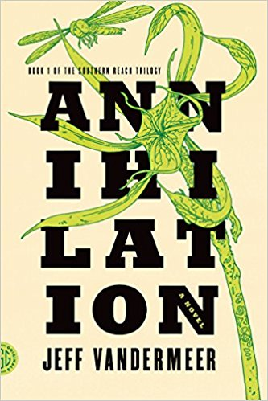

I'm not a fan of horror movies. I don't enjoy cheap scares and I don't appreciate the shock value of the grotesque (though I don't mind blood and guts in other contexts). I also have a hard time not picking out the often terrible choices that characters in most horror movies make ("There's a killer somewhere in the house... let me run back in to grab my cellphone.").

I don't mind horror in books though. Especially when novel sci-fi concepts get involved.

I've had [_Annihilation_](https://www.goodreads.com/book/show/17934530-annihilation) by Jeff VanderMeer gathering dust on my shelf for over a year (I'd like to think that I'm getting better about my buy-so-many-books-that-I-could-never-read-them-all addiction, but it's not a battle I'm actively fighting). The amazing cover art first caught my attention.1 It is the first entry in the _Southern Reach_ trilogy, followed by [_Authority_](https://www.goodreads.com/book/show/18077769-authority) and [_Acceptance_](https://www.goodreads.com/book/show/18077752-acceptance).

Funnily enough, I pulled up YouTube the other day to check if my sound was working and clicked on a random video only to realize it was the [trailer for the movie adaptation of _Annihilation_](https://www.youtube.com/watch?v=89OP78l9oF0)! It comes out in theaters next year with Natalie Portman playing the protagonist.

**SPOILERS AHEAD!**

The first-person narrative follows the biologist, an introverted, impulsive scientist, who, along with three other eponymous professionals - the psychologist, the surveyor, the anthropologist - is trying to survive in an unpopulated tropical expanse called Area X.

Restlessness pervades throughout. The choppy narration matches the overwhelming nature of Area X and the rapid-fire rate of new information. Excursions beyond the base camp lead to new mysteries, like the creature wandering through the reeds nearby moaning in a way that sounds primeval and vaguely human. There's the Tower, a structure that is, effectively, a tunnel because it rises only a few feet above ground. There's the seemingly biblical passage run-on sentence written in fungus spiralling down the inner wall of the Tower. There's the Crawler, the unknowable creature writing the fungi.

> Nothing that lived and breathed was truly objective—even in a vacuum, even if all that possessed the brain was a self-immolating desire for the truth.

_Annihilation_ calls reality into question. Over the course of the story, the narrator becomes increasingly unreliable, and even acknowledges it. She starts hallucinating early on after inhaling some spores of the word-wall fungus. Repeatedly, she describes a scene, then goes back to amend details and give a broader picture of what she experienced, which usually involves some kind of ESP. The fungus seems to have given her a "brightness" that puts her in deeper touch with the world around her. She and other infected indviduals glow with phosphorescense, even after death.

The biologist's descriptions, or maybe the world around her, become contradictions.

The Crawler is one such contradiction - an uncondensed waveform that rapidly shifts through impossible shapes while still appearing vaguely human. The biologist thinks that the Crawler, or whatever entity created the Crawler, is an infinity mirror that blurs the world around it. One-by-one, the explorers become a part of Area X. Distrustful, they turn against one another. The biologist thinks that the animals she encounters look too human, like the dolphin with a human eye or the flight of a hodgepodge of birds, eagles and owls and hawks flying in formation. Maybe the explorers are turning into Area X? And there's speculation that Area X is spreading. Some explorers ostensibly return to civilation, though the person that comes back is a smiling shell of the one who left. The biologist's husband was one such returned explorer, who left a gregarious adventurer and came back with pleasant words, dim eyes, and metastatic cancer.

> We were neither what we had been nor what we would become once we reached our destination.

We never get a full explanation of Area X (this is, after all, the first part of a trilogy). We get an acid trip expedition into the jungle that reads like the ramblings of a schizophrenic loner, which I believe is exactly what Jeff VanderMeer had in mind.

> That's how the madness of the world tries to colonize you: from the outside in, forcing you to live in its reality.

Only a few flaws pulled me out of the story. Though the biologist's rantings about the true nature of Area X rely on her scientific expertise, the author barely handwaves scientific details. This feels especially incongruous especially given we learn the biologist wrote this story in her field journal. Microscopes are lamely described as "short" and "long." The biologist glances into her "short microscope" and comments that, "I knew it was a human cell." _Really?_ The biologist states that "I knew it was a brain cell." Why not something mildly more realistic like, "the tissue sample appeared to be a collection of axons and dendrites?" In the context of the volume of detail that surrounds the rest of Area X, the missing science feels like a glaring oversight.

In the end, the shortcomings of _Annihilation_ are easy to overlook. It's a fun, fresh read and easy to recommend. The thrills feel deserved. The frenetic writing keeps pace with the evolving mystery of Area X. I probably won't finish the trilogy (I rarely try to finish series), but I'm definitely going to see it in theaters!

1There's probably a joke about judging books by their covers in here somewhere, but it's not coming to me.
