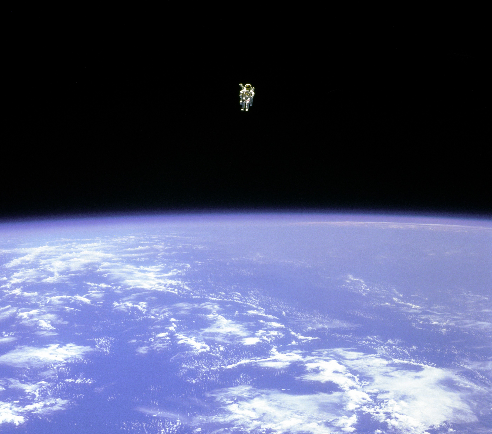
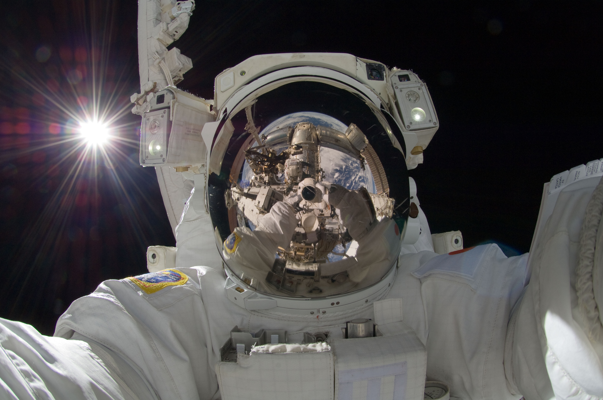
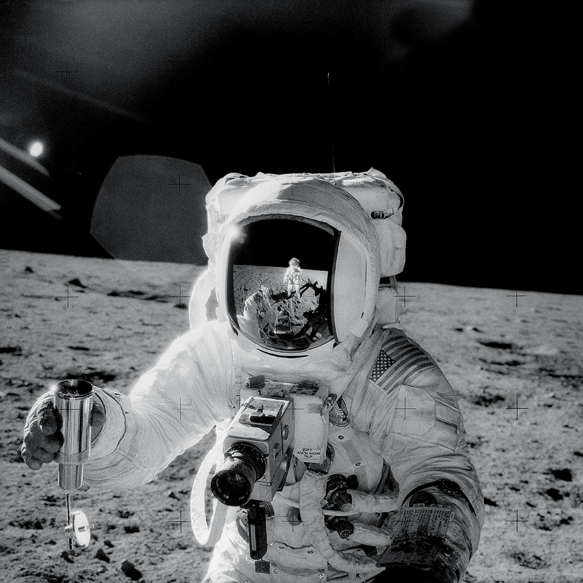
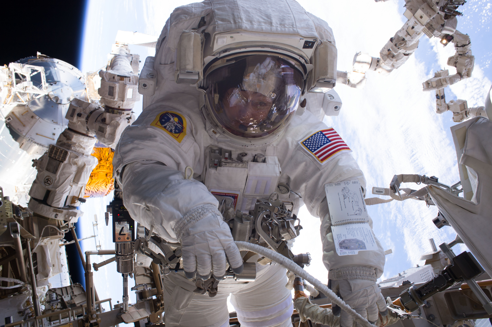
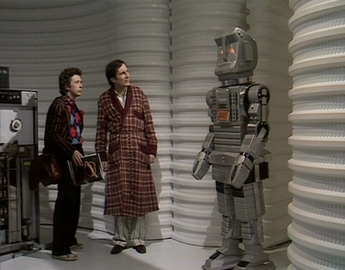

_Bruce McCandless II free floating 100m from the space shuttle Challenger in 1984. See [APOD](https://apod.nasa.gov/apod/ap120101.html) for more info. Image copyright NASA._

Human beings in spacesuits outside of spacecraft have taken some of the most remarkable pictures of the modern age.

_JAXA astronaut Aki Hoshide taking a selfie on a spacewalk in September of 2012. See [APOD](https://apod.nasa.gov/apod/ap120918.html) for more info. Image copyright NASA._

_Edward White outside Gemini 4 on the first ever spacewalk on 3 June 1965. See [APOD](https://apod.nasa.gov/apod/ap150606.html) for more info. Image copyright NASA._

I’ve been fortunate enough to work with the space community for the last two years on a project to make their jobs easier. What follows is my account of the problems we wanted to solve, the learnings from our research, the prototypes we built, the mistakes we made, and the evolution of Marvin, our software suite, from idea to stable software and funded research project.[^1]

---

Spacewalks fall under a broad mission category known as extravehicular activity (EVA).

Astronauts perform spacewalks routinely, but they're anything but routine. Crew members leave the spacecraft only when necessary, such as for hardware installations, repairs, and, during the Apollo missions, exploration.

_Pete Conrad took this photo of Alan Bean exploring the Moon on EVA. Here he is collecting lunar soil samples during Apollo 12. See [APOD](https://apod.nasa.gov/apod/ap060121.html) for more info. Image copyright NASA._

Every astronaut on EVA faces heightened risk. They rely on portable life support systems (LSS), which provide limited consumable resources like oxygen and battery power. They face direct exposure to space, an already hostile environment even before considering the possibility of hardware malfunctions, micrometeroid impacts, sudden solar flares, and a million other incapacitating events. In the event of an emergency, crew members must react quickly and precisely to stave off disaster. In fact, over the nearly sixty-year history of EVAs, almost 30% of EVAs have experienced some kind of significant anomalous event that required real-time troubleshooting.[^2]

Given the risk and complexity of EVAs, each one is a highly choreographed event, sometimes years in the making. As a current example, the [Alpha Magnetic Spectrometer](https://www.nasa.gov/mission_pages/station/research/experiments/742.html) (AMS), an external particle detector onboard the International Space Station (ISS), [currently needs repair](https://arstechnica.com/science/2017/04/nasa-is-planning-a-daring-repair-mission-to-save-a-2-billion-particle-detector/). It has already outlived its planned three-year mission lifespan and cooling pumps have been failing. They weren't designed to be replaced and they're tucked inside a nasty nest of sharp surfaces at an already awkward location. NASA built a full-scale replica of the AMS for use underwater at the Neutral Buoyancy Lab (basically a massive swimming pool for weightlessness training) and astronauts will have been training for years for this specific mission by the time repairs begin. Like every EVA, the crew members repairing the AMS will be in constant, direct contact with personnel in Mission Control Center (MCC) throughout the mission. In fact, mission operations / flight controllers at MCC (who I'll frequently abbreviate as "ops") will effectively call every shot. They will keep track of the mission timeline, task status, and suit telemetry (data describing the state of the spacesuit). The astronauts act as actresses following a highly detailed script with little opportunity for ad-libbing. An additional crew member (or crew members) inside the spacecraft, known as the intravehicular (IV) crew, will monitor many of the air lock systems and the robotic arm while also communicating with ground and extravehicular (EV) crew members.

_Peggy Whitson on her 7th EVA outside ISS in January of 2017. During this EVA, she and Shane Kimbrough hooked up new batteries and performed a photo survey of AMS. Note the cue cards on her left forearm. EV crews like to keep detailed procedures handy. Image copyright [NASA](https://www.nasa.gov/image-feature/astronaut-peggy-whitson-during-a-spacewalk)._

The few people at risk in space benefit from dozens (maybe hundreds) of experts on the ground analyzing, predicting, and optimizing throughout EVA execution to ensure mission success. In low Earth orbit (LEO), cislunar space (between Earth and the Moon) or on lunar EVAs, keeping MCC in the loop for all decision-making is a viable operations concept because the speed of light allows it. ISS orbits in LEO a few hundred kilometers above the ground, where the communication lag is somewhere in the hundreds of milliseconds - too high for most online video games but still good enough for FaceTime. In more official terms, we call the lag one-way latency time (OWLT). The Moon has an OWLT of just over one second. MCC to Moon communications are awkward like a really bad connection on an overseas video conference, but they still enable real-time communication and decision making.

Exploration targets beyond the Moon increasingly isolate crew members. Most reasonable near-Earth asteroid targets are distant enough that OWLT is measured in minutes. Mars has a OWLT between 4 and 22 minutes, depending on our orbital orientation. Ground cannot provide anything resembling real-time feedback if we're hamstrung by question-response cycles that could take the better part of an hour. Clearly, we need to rethink our EVA operations concept before we get to Mars.

A NASA researcher, Matthew Miller, began working on this problem during his doctoral research at Georgia Tech. He asked how crew members could support themselves on EVA under time-delayed operational constraints. He envisioned a multi-pronged approach, where a mix of operational changes and technology would afford crew members greater independence. In a friend-of-a-friend set of circumstances, Matthew and I met two years ago and I agreed to help with the technology for his thesis, primarily by building the decision support system (DSS) software behind both the control group and an advanced prototype with independence-enabling features. In the two years since then, we've been able to test our prototype with real astronauts on EVAs underwater on coral reefs in the Florida Keys, simulated astronauts hiking around lava flows in Hawaii and Idaho, and PhD candidates playing Martian explorers in laboratory controlled exercises.

_An aquanaut working with coral samples in Key Largo as part of NEEMO 22 in June 2017. Image copyright [NASA](https://www.nasa.gov/mission%5Fpages/NEEMO/index.html)._

_NASA researchers Kara Beaton and Rick Elphic survey volcanic terrain on Mauna Loa as part of BASALT in August 2016. I actually took this picture._

Our work focused on augmenting the observational and predictive capability of the IV crew member who remains inside the spacecraft while her EV counterparts perform tasks outside. If an IV could be as operationally aware of an EVA as the ground, our thinking goes, then the crew could safely perform EVAs without real-time support from MCC. Matthew spent hundreds of hours learning from NASA mission operations controllers, including observing ISS EVAs from MCC and interviews designed to extract the flow of information and level of importance of information on decision making during EVAs. He and I also participated in multiple analog EVA missions, during which we simulated exploration-style EVAs alongside multidisciplinary scientists, flight controllers, and operations researchers in the field. Currently, Matthew is continuing his research at [Jacobs](https://www.wehavespaceforyou.com), a NASA contractor, where he is building a hybrid reality (VR + interactive physical objects) lab capable of repeated, controlled simulated EVAs (among other EVA-related projects).

## Why Marvin?

I’m a huge fan of sci-fi and _Hitchhiker’s Guide to the Galaxy_ (HHG2G). Marvin the Paranoid Android constantly complains about how smart he is and how slim the odds are for survival. I figured that Marvin is the perfect name for a DSS keeping people alive in space.

_I was going to post a picture of [Marvin](http://hitchhikers.wikia.com/wiki/Marvin?file=Marvin.jpg) from the newer HHG2G, but Arthur's bathrobe was just too good to pass up. Image pulled from [here](http://hitchhikers.wikia.com/wiki/Marvin?file=Marvin%5Fmeets%5FFord%5Fand%5FArthur.jpg)._

> I have a million ideas. They all point to certain death.
>
> <cite>Marvin the Paranoid Android</cite>

> I’ve calculated your chance of survival, but I don’t think you’ll like it.
>
> <cite>Marvin the Paranoid Android</cite>

Incidentally, Matthew hadn't read HHG2G when I suggested Marvin for the name for the project. His response: "let me read the book first before I decide if it's okay for this name to end up in my thesis because it's going to be around forever.” Not long after, the name Marvin became official.

(This led to some funny conversations. Everything in the space industry is an acronym. I got a few responses like, “are you even _allowed_ to name something without an acronym?” when I would explain that Marvin is in fact not MARVIN.)

> If the name doesn’t mean anything, then it becomes increasingly hard to remember what the service does if you see it in code.
>
> <cite>one of my colleagues (we've got a lot of services at Udacity named after obscure Star Wars planets and Game of Thrones cities)</cite>

Naming your services after pop culture references isn't always a good idea. There’s a difference between making a useful comparison and obfuscating the purpose of code. I’d argue that Marvin itself was an acceptable reference, but I think I toed the line later on when I extended the analogy to lesser known nouns in the HHG2G universe. I called the eventual server running Marvin the _Heart of Gold_, Marvin the Paranoid Android’s home ship. The _Infinite Improbability Drive_ was responsible for running calculations and predictions in Marvin. It got its name from the eponymous engine in the Heart of Gold that moves the ship by “[passing] through every conceivable point in every conceivable universe simultaneously.” Both examples make sense, but only if you know HHG2G. If Marvin ever expands to a team with more developers, these names will need to change.

_Coming up next in [part 2](/posts/20180204-marvin-apollo-timelines/): learning from history with Apollo exploration EVA timelines._

[^1]: We presented an overview of our research and prototypes at [IAC 2017](http://www.iafastro.org/events/iac/iac-2017/): Miller, M., Pittman, C., & Feigh, K. 2017, 'Next-Generation Human Extravehicular Spaceflight Operations Support Systems Development', IAC 2017. Adelaide, SA. ([Download here](https://www.researchgate.net/publication/320290594_Next-Generation_Human_Extravehicular_Spaceflight_Operations_Support_Systems_Development))

[^2]: See page 42 of Matthew’s PhD thesis: "As of July 27th, 2016, NASA had performed 391 EVAs, 28% of which experienced significant incidents such as crew injury, early termination, system and operational issues (Packham and Stockton, 2016)." Miller, Matthew. (2017). Decision Support System Development for Human Extravehicular Activity. . 10.13140/RG.2.2.17731.30248. ([Download here](https://doi.org/10.13140/rg.2.2.17731.30248))
