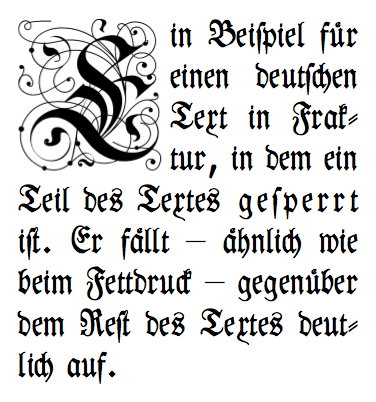
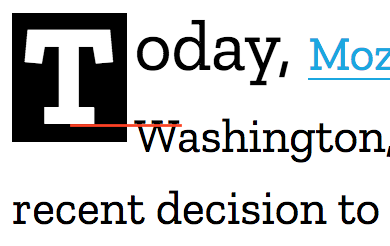
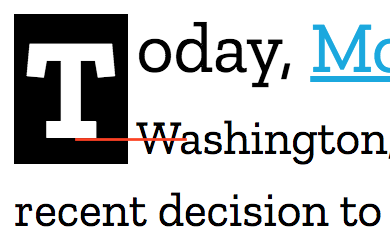

It's hard to do front-end development and _not_ notice the little things about other websites. Extra margin here, great responsiveness there, etc. In particular, I love typography. Not enough that I would take on a career as a designer, but I appreciate a well put together piece of text. I'm working on another long post article about [Marvin](/posts/20180115-marvin-deep-spacewalks/) right now and decided to get fancy with my lead in text.



_[Not this fancy](https://commons.wikimedia.org/wiki/File:Emphasis%5Ftypography2.png)._

The big first letter is something called "drop caps," which was news to me. You see this on the web too.


_Mozilla used drops caps and a few other lead-in techniques with their [blog post](https://blog.mozilla.org/blog/2018/01/16/mozilla-files-suit-fcc-protect-net-neutrality/) about fighting the FCC's decision to revoke Net Neutrality._

I love everything here. Neat trick of inverting the colors on the dropped cap. Great font (which I believe is custom). The first line is a bit larger and captures your attention. In the same way, the whole first paragraph is larger, which makes sense because it's a summary and should grab your attention. And not to mention, I like it because I support their efforts.

It's probably worth mentioning that these styles are luxuries for screens with a lot of real estate. You wouldn't want a single letter to take up half a screen. If you look at the mobile version of Mozilla, the first paragraph loses its styling and renders as normal text.

In researching how to replicate drop caps and lead in paragraphs, I came across a few CSS pseudoselectors I wasn't aware of:

* [`::first-line`](https://developer.mozilla.org/en-US/docs/Web/CSS/::first-line)
* [`::first-letter`](https://developer.mozilla.org/en-US/docs/Web/CSS/::first-letter)

Both of which do exactly what you think they're doing. Combined with [`:first-child`](https://developer.mozilla.org/en-US/docs/Web/CSS/:first-child) and it's easy to create an eye-catching start to any article.

Here's how I'll be using them:

```css
@media (min-width: 600px) {
  .lead-in {
    font-size: 22px;
    line-height: 1.5;
  }

  .lead-in:first-letter {
    float: left;
    font-size: 78px;
    padding-top: 2px;
    padding-right: 8px;
    padding-left: 2px;
    line-height: 1;
  }

  .lead-in:first-line {
    font-size: 32px;
  }
}
```

```html
<p class="lead-in">Lorem ipsum dolor sit amet...</p>
```

Which renders [like so](/hts-drop-caps.png):

---

<p class="lead-in">Not a sunrise but a galaxyrise, descended from astronomers, extraplanetary. Consciousness permanence of the stars! Tesseract the only home we've ever known consciousness birth. Vastness is bearable only through love!</p>

Kindling the energy hidden in matter, Flatland colonies, globular star cluster network of wormholes made in the interiors of collapsing stars, Jean-Francois Champollion extraplanetary, colonies Drake Equation trillion billions upon billions! Network of wormholes and billions upon billions upon billions upon billions upon billions upon billions upon billions!

---

_Lorem ipsum from [Sagan Ipsum](http://saganipsum.com/?p=1)._

Billions!

---

_Update!_

There's a difference between the way Chrome and Firefox render the drop cap. I switch back and forth between Firefox and Chrome in my usual workflow and I noticed the drop cap shifting vertically. At first I thought I wasn't being careful with my CSS, which wouldn't be unusual. But no, this looks like an actual bug. There are slight differences between the Firefox and Chrome rendering of the Mozilla drop cap.



_Firefox_



_Chrome_

The inverted background on the drop cap makes it hard to notice the difference, but it's there. I actually think the Chrome version looks a little better as the bottom of the background on the 'T' lines up with the bottom of the second line of text.

Here's what I was seeing on my blog. I did my final spot checks before publishing using Chrome.


_Firefox_


_Chrome_

It looks like Firefox prioritizes and applies `line-height` differently when you define `first-letter` and `first-line`. I'm not 100% sure why but [this thread](https://bugzilla.mozilla.org/show_bug.cgi?id=371787) might be relevant? I really dislike browser hacks, but I'm also anal retentive about this sort of thing so I went looking for hacks. I came across [`@-moz-document`](https://developer.mozilla.org/en-US/docs/Web/CSS/@document), which I liked for its declarative specificity but no, it's [a security risk and will be dropped in Firefox 59](https://www.fxsitecompat.com/en-CA/docs/2015/moz-document-support-will-be-dropped/). Diving deeper, I found the [`@supports` query](https://css-tricks.com/the-at-rules-of-css/#article-header-id-10). It's even hackier, but you can check if a browser supports a specific CSS property and then apply styles accordingly. Here's how I changed my media query to account for Firefox's weirdness.

```css
@media (min-width: 600px) {
  .lead-in {
    font-size: 22px;
    line-height: 1.5;
  }

  .lead-in:first-letter {
    float: left;
    font-size: 78px;
    padding-top: 2px;
    padding-right: 8px;
    padding-left: 2px;
    line-height: 1;
  }

  .lead-in:first-line {
    font-size: 32px;
  }

  /* firefox only */
  @supports (-moz-appearance:none) {
    .lead-in:first-line {
      line-height: 1;
    }
  }
}
```

I'm checking if the browser supports [`-moz-appearance`](https://developer.mozilla.org/en-US/docs/Web/CSS/-moz-appearance), which is a buggy, experimental technology but not one that's slated to be deprecated. In any case, I'm not actually using it, just checking if it's available. Badda bing badda boom, now the drop caps look great everywhere!
