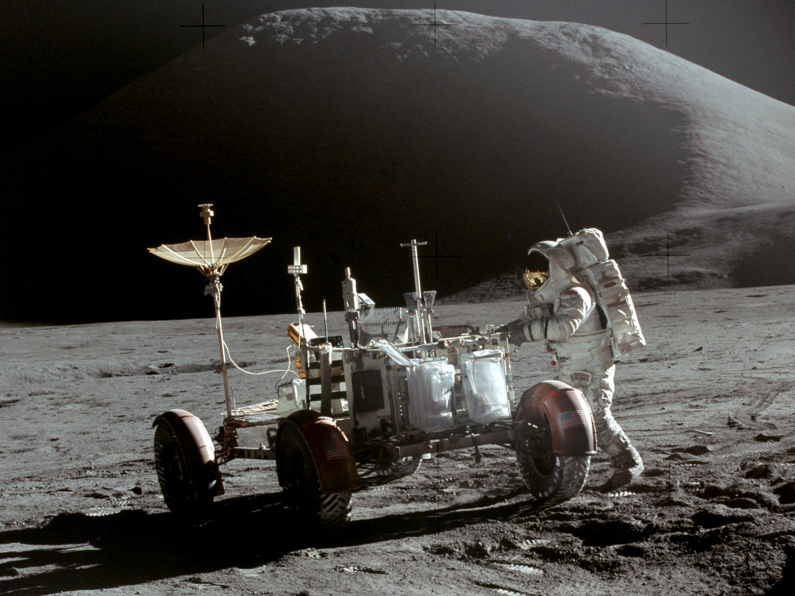
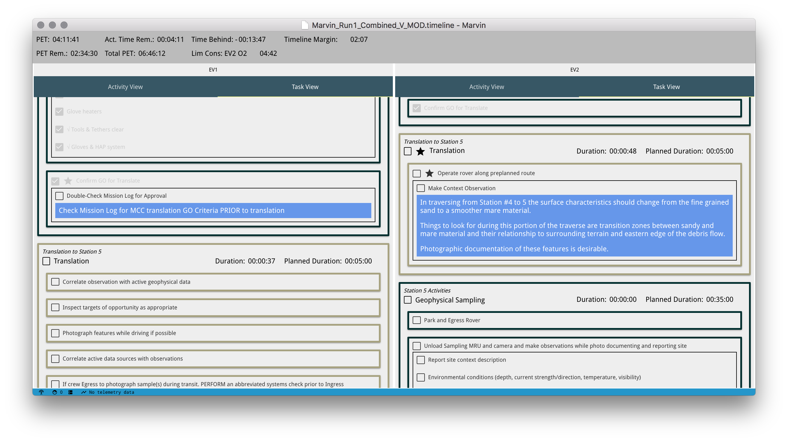

_This is part 2 of the Marvin series. Here’s [part 1](/posts/20180115-marvin-deep-spacewalks/) about why extravehicular activity (EVA) operations research matters._

It's the early 1960s. Picture yourself in a meeting at NASA with scientists, engineers, flight controllers, and astronauts. Everyone's wearing horn-rimmed glasses, short sleeved shirts, and thin black ties. The summer humidity in Houston makes the air sticky. You feel your allergies flaring up from the cigarette smoke wafting over the table, but you easily ignore your discomfort because you’re talking about landing on the Moon in the next decade.

The astronauts want to know what kind of flight controls the Lunar Module will have. The engineers are wringing their hands about life support systems because humans are so damn difficult to keep functioning compared to abiotic satellites. An administrator hounds the astronauts about their scheduled public appearances to drum up support about beating the Russians who just put Yuri Gagarin in space. With a polite _ahem_, the scientists bring up the topic of what exactly the astronauts should sample on the Moon. The flight controllers nod in agreement.

"Yes," the flight controllers say, "we're glad you brought that up."

_Yuri Gagarin, a cosmonaut and the first person in space. What a badass. He orbited the Earth for the first time on 12 April 1961, adding fuel to NASA's drive to beat ROSCOSMOS (or Роскосмос in Russian) to the Moon. Image from [here](https://news.nationalgeographic.com/news/2011/04/110412-yuri-gagarin-anniversary-google-doodle-first-orbit-space-science/#/34466.jpg) by Popperfoto/Getty Images._

This is where the story of Marvin picks up - executing spacewalks. Looking through the history of space exploration, human-performed exploration is a rare phenomenon. All astronauts are explorers in the philosophical sense, but only a few astronauts have explored in the Darwin-in-the-Galapagos kind of way. The first EVAs performed in the Gemini and early Apollo missions tested engineering limits. Similar to the Space Shuttle crews before them, modern spacewalkers on the International Space Station (ISS) are construction workers in space performing engineering tasks on engineered surfaces. Only the EV crews on Apollo 15 - 17 stepped out of an airlock with the goal of finding something cool outside.

## Apollo Moonwalks

Early Martian EVAs will likely mimic the pattern established in the Apollo missions. Engineering objectives outweighed scientific objectives on the first lunar landings, Apollo 11-14, during which lunar pioneers _egressed_ (meaning they left the airlock; as opposed to _ingressed_ when they reentered the airlock) to stretch their legs on the [regolith](https://en.wikipedia.org/wiki/Regolith) and test equipment and procedures. The EV crews on the later missions, Apollo 15-17, focused on lunar science. Notably, the Apollo 17 crew included [Harrison Schmitt, the first and only PhD geologist to do field work on a different world](https://www.space.com/20789-harrison-schmitt-astronaut-biography.html).

_Harrison Schmitt uses a lunar rake to sift through the regolith for samples between 0.5 and 1 inch in size. This photo was taken during the first EVA of Apollo 17 at Station 1. Image from [NASA](https://www.nasa.gov/audience/foreducators/spacesuits/historygallery/ap-dec72.html)._

If you want to optimize a procedure, whether it's tying a shoelace or doing interplanetary science, you need to test. You need to make mistakes and learn from them. In that vein, exploration EVAs are uncharted territory. There are only nine examples of exploration EVAs, all of which come from Apollo 15-17. As the possibility of future lunar, asteroidal, and Martian EVAs looms on the horizon in the next decades, researchers like Matthew Miller have been [revisiting Apollo missions](http://www.news.gatech.edu/features/lunar-landing-logs) in an effort to learn as much as possible about the realities and operational concepts - the collection of rules, information flows, and decision making strategies - that influence EVA mission success.

NASA obsessively plans EVAs for good reason. With higher resolution understanding of the state of an EVA, the better we can prevent unforeseen circumstances from derailing objectives. Apollo EVA planned timelines have minute level resolution, as in, we know what astronauts _should_ have been doing during every 60 second period of the mission. Of course, what _actually_ happened is a different story. In a collection of papers, Matthew and other operations researchers compared planned and executed timelines from the lunar EVAs of Apollo 14-17.[^1]&#8203;[^2]&#8203;[^3] We generally call this comparison the _time behind_, which reflects the fact that EVAs tend to fall behind schedule. Given that a timeline consists of an un-gapped sequence of tasks, each with a defined start time (more on how tasks are defined in a moment), you can calculate the deviation between the planned and executed timelines with:

[^1]: Miller, M. J., Claybrook, A., Greelund, S., Marquez, J., Feigh, K (2017). Operational Assessment of Apollo Lunar Surface Extravehicular Activity. NASA/TP-2017-219457, ARC-E-DAA-TN39193, NASA Ames Research Center https://ntrs.nasa.gov/search.jsp?R=20170007261

[^2]: Miller, M. J., Claybrook, A., Greenlund, S., & Feigh, K. M. (2016). "Operational Assessment of Apollo Lunar Surface Extravehicular Activity Timeline Execution", AIAA SPACE 2016, AIAA SPACE Forum, (AIAA 2016-5391) https://doi.org/10.2514/6.2016-5391 

[^3]: Greenlund, S., Miller, M. J., & Feigh, K. M. (2017). "Operational Assessment of Apollo Lunar Surface Extravehicular Activity Metabolic Rate", AIAA SPACE and Astronautics Forum and Exposition, AIAA SPACE Forum, (AIAA 2017-5115) https://doi.org/10.2514/6.2017-5115 

$$
\begin{aligned}
\text{time behind} = &\text{actual mission clock at start of task} \\
&- \text{planned mission clock at start of task}
\end{aligned}
$$

The EVA clock is called the Phased Elapsed Time (PET). It starts at 00:00:00 (HH:MM:SS) at an agreed point time that signifies the official start of the EVA, usually when the first crew member egresses and counts up until the last crew member ingresses.

EV crews from Apollo can be classified as performing three different categories of activities: traverse, overhead, and station activities. EVAs began with egress and overhead tasks like equipment checks. Once complete, they generally cycled between traverse and station activities. During traverse activities, EV crews relocated to a worksite - in the case of Apollo 15-17 they took advantage of a lunar rover to reach distant sample sites. Either before they left or once they arrived at the worksite, they performed station related tasks such as collecting samples or making observations with the scientific equipment they brought along. Once finished, they would either traverse to another station or head back to the Lunar Module to perform a final overhead activity to prepare for ingress.

_David Scott took this amazing shot of Jim Irwin and the Lunar Roving Vehicle from EVA 1 of Apollo 15. Mount Hadley rises in the background. Photo by NASA/David Scott [Public domain], via [Wikimedia Commons](https://commons.wikimedia.org/wiki/File%3AApollo%5f15%5fLunar%5fRover%5fand%5fIrwin.jpg)._

Matthew and co. took a look at how time behind varied throughout Apollo 14 - 17 exploration EVAs. Take a look at this graph.

_Miller et al,[^1] page 66, figure 33. Average time behind for Apollo 14 - 17 EVAs. Time behind generally increased as missions progressed. The x-axis shows PET and the y-axis is time behind. Phase 1 is mostly egress and overhead, phase 2 and 3 consist of cycles of traversal and station activities with little overhead. Phase 4 finished the EVA with completing station activities and ingress._

Time behind typically got worse as EVAs progressed. Egressing generally proceeded at a nominal pace (NASA-speak for "expected" or "within acceptable bounds"), but pretty much everything else took longer than expected. In fact, after phase 1, or roughly the first hour of EVA, 79% of the remaining as-performed timeline estimations were behind schedule (Miller et al,[^1] page 64, section 4.5.1). The few points that contradicted the tendency to fall behind almost always benefited from cutting prior tasks from the as-performed timeline.

I'll leave diving into the full set of statistics as an exercise for the curious. (I recommend reading section 4.5, "Aggregate EVA Timeline Execution Trends," of Miller et al[^1] for a fascinating summary of lunar timeline trends.) Suffice it to say that planetary surface science takes more time than you think. But that's no excuse for failing to stick to a timeline when you're aware of the tendency for delays and you have the planning time to preempt them. Marvin is our first attempt at subverting exploration EVAs that run fashionably late, or at the very least, making the crew aware that they're behind schedule.

## Starting to Stay on Time with Marvin

Professionals in every discipline obsess over different details. Copy editors obsess over Oxford commas. Flight controllers obsess over schedules. Field scientists obsess over how to collect samples.[^4] As a software engineer, I obsess over data structures and the relationships they represent.

[^4]: One occasion that stands out occurred during [BASALT](https://spacescience.arc.nasa.gov/basalt/) 2016 in one of our daily meetings. We had had a rough simulated EVA earlier that day when the EV crew spent an extra hour struggling to collect rock samples from an area with very hard surrounding material. As the geologists were trying to explain better sampling procedures to the non-geologists in the room, an impromptu, surprisingly passionate debate sprung up about the names for the different ways to strike a rock with a hammer. There were factions within the geologists, notably along national lines. The Brits won with the term "cheeky knock," which describes a soft strike to determine hardness. It instantly became canon, showing up in our sampling procedures and I'm sure has since been published in geology journals 😜 More importantly, it highlights how science and exploration are multidimensional, multidisciplinary endeavors. No single specialty can do it alone - it takes teams of scientists, engineers, explorers, and experts from all fields and all walks of life to make a mission a success.

_A quick look at Marvin's timeline interface. I won't be going into details about it yet, but this is the second post in the series and I figured it made sense to add some context about the end result._

In order to build an interactive timeline or calculate time behind, we needed to describe every component of a timeline and their relationships. Anyone who has worked with a database before would recognize this as a [schema](http://database.guide/what-is-a-database-schema/), or a formal method for representing relationships between data.

_Coming up next: I'll be diving into Marvin's schema and applying it to a Martian EVA._
